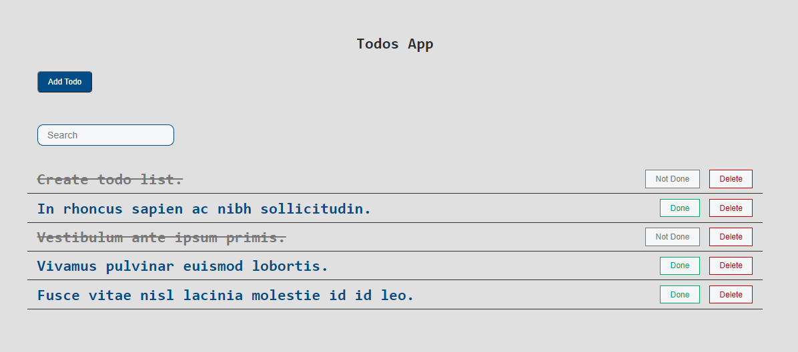

# To Do App Assignment

## Please follow the below steps to run the backend project

1.  Run command "npm install" on your terminal.
2.  Run command "npm run dev" on your terminal to start the app.

### Swagger API Docs

1.  Run command "npm install" on your terminal.
2.  Run command "npm run dev" on your terminal to start the app.
3.  Goto 'localhost:1337/api-docs' to view the swagger docs

### Testing

1.  Run command "npm install" on your terminal if not already done in previous steps.
2.  Run command "npm run test" to run testing.
3.  Test results will be logged on your console.

### eslint

1. Run command "npm install" on your terminal if not already done in previous steps.
2. Run command "npm run lint"

## Please follow the below steps to run the client side project

1.  Run command "npm install" on your terminal.
2.  Run command "npm run start" on your terminal to start the app.
2.  Goto 'localhost:3000' to view the app.

### Testing

1.  Run command "npm install" on your terminal if not already done in previous steps.
2.  Run command "npm run test" to run testing.
3.  Test results will be logged on your console.
